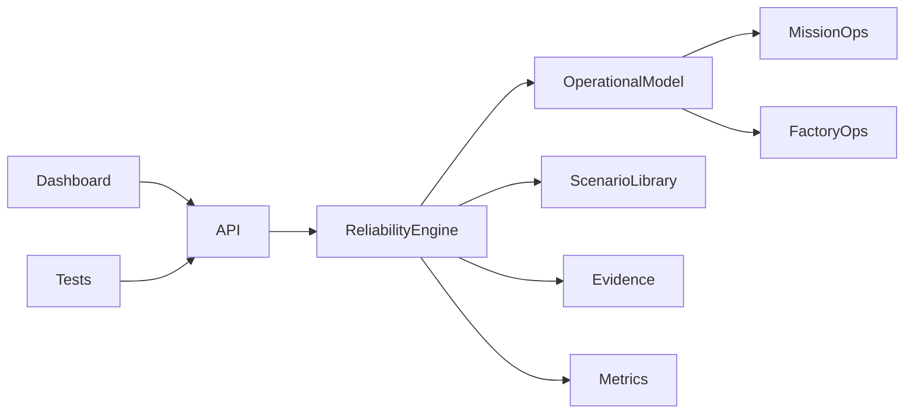

# Orbital Reliability Lab

[](https://github.com/Lordkoii/Orbital-Reliability-Lab/actions/workflows/ci.yml)

> **Reliability should be tested before it becomes an incident.**

**Orbital Reliability Lab (ORL)** is a systems reliability, automation, validation, and operations engineering lab for simulated high-consequence environments.

ORL currently models two operational domains on one shared reliability core:

- **Mission Operations** — ground systems, telemetry, command, tracking, redundancy, and failover
- **Factory Operations** — equipment lifecycles, material flow, MES dependencies, production-state protection, and process visibility

ORL is an independent engineering portfolio project. It is **not affiliated with SpaceX, Tesla, Starlink, Terafab, or their subsidiaries**, and it does not reproduce proprietary systems or processes.

## v0.3 — Operational State Models

v0.3 makes the simulated assets stateful and dependency-aware.

The shared response contract is now:

`INJECT → DETECT → DIAGNOSE → ISOLATE → RECOVER → VALIDATE → EVIDENCE`

### Mission Operations

Nominal telemetry path:

`GS-A (PRIMARY) → TEL-GW-01 → MDB-01`

with `GS-B` held in `STANDBY`.

A ground-link incident can now transition the system through:

- GS-A: `PRIMARY → DEGRADED → FAULT → RECOVERING → PRIMARY`
- GS-B: `STANDBY → FAILOVER → PRIMARY → STANDBY`
- telemetry gateway: dependency-aware degraded/failover states
- active path changes during recovery

### Factory Operations

Process equipment now implements a simplified lifecycle:

`IDLE → SETUP → RUNNING → COMPLETE → IDLE`

Shared-system failures produce operational consequences rather than only metric changes:

- **MES outage** → process equipment enters `HOLD`
- **AMHS saturation** → process equipment becomes `STARVED`
- **Metrology link loss** → simulated quality hold

## What the project demonstrates

- state-machine design
- dependency-aware failure propagation
- redundancy and failover modeling
- controlled fault injection
- threshold-based incident detection
- automated/manual recovery
- post-recovery validation
- operational impact modeling
- MTTR and incident evidence
- Prometheus-style system and per-asset metrics
- Node + Playwright test automation
- GitHub Actions CI
- Dockerized execution

## Run locally

```bash
npm start
```

Open `http://localhost:3000`.

## Tests

```bash
npm test

npm install
npx playwright install chromium
npm run test:e2e
```

## API

| Method | Endpoint | Purpose |
|---|---|---|
| `GET` | `/api/telemetry` | Environment, asset states, health, active flow, impact, and metrics |
| `GET` | `/api/environments` | Available simulation environments |
| `POST` | `/api/environment` | Switch Mission / Factory Operations |
| `GET` | `/api/scenarios` | Scenarios for the active environment |
| `POST` | `/api/scenarios/run` | Run a domain-specific controlled failure |
| `POST` | `/api/systems/advance` | Advance a factory equipment lifecycle |
| `GET` | `/api/events` | Incident and recovery evidence stream |
| `GET` | `/api/metrics` | Prometheus-style global and per-asset metrics |
| `GET` | `/api/health` | Health endpoint for probes |
| `POST` | `/api/faults` | Inject a generic infrastructure fault |
| `POST` | `/api/recover` | Trigger manual recovery |
| `POST` | `/api/auto-recovery` | Arm/disarm automatic recovery |
| `POST` | `/api/reset` | Reset the active environment |

Example:

```bash
curl -X POST http://localhost:3000/api/scenarios/run \
  -H "Content-Type: application/json" \
  -d '{"id":"mission-ground-link-degradation"}'
```

## Architecture



See:

- [`docs/ARCHITECTURE.md`](docs/ARCHITECTURE.md)
- [`docs/STATE-MODELS.md`](docs/STATE-MODELS.md)
- [`docs/ROADMAP.md`](docs/ROADMAP.md)

## Direction

The project is intentionally growing toward engineering concepts relevant to both advanced manufacturing systems and space/mission reliability work.

Near-term tracks include:

- factory lot / wafer / recipe and mini-MES simulation
- richer mission network and telemetry routing
- MQTT and OPC-UA equipment communications
- PostgreSQL + Grafana observability
- SPC / process-drift detection
- factory FAT/SAT-style qualification
- mission readiness validation

## Author

**Alexander Taylor** · [Lordkoii](https://github.com/Lordkoii)
