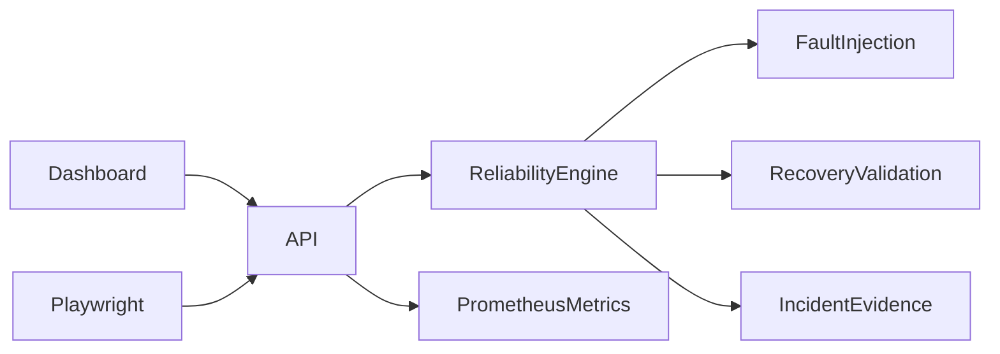

# Orbital Reliability Lab

[](https://github.com/Lordkoii/Orbital-Reliability-Lab/actions/workflows/ci.yml)

> **Reliability should be tested before it becomes an incident.**

A mission-control-inspired engineering lab that demonstrates controlled fault injection, threshold-based detection, fault-domain isolation, automated recovery, validation, and incident evidence capture.

This is an independent portfolio project built to demonstrate practical QA, reliability, automation, incident-response, and platform-engineering thinking. It is **not affiliated with SpaceX, Tesla, Starlink, or any of their subsidiaries**.

## What it demonstrates

- Controlled fault injection: latency, packet loss, CPU saturation, and service outage
- Detection of degraded system behavior
- Automated or manual recovery paths
- Post-recovery health validation
- MTTR measurement and incident event evidence
- API and UI automation using Playwright
- CI validation through GitHub Actions
- Containerized execution with Docker
- A compact mission-control-style observability dashboard

## Reliability loop

`INJECT → DETECT → ISOLATE → RECOVER → VALIDATE → EVIDENCE`

The point is not the simulated spacecraft context. The point is the engineering loop: create a known failure, detect it, recover it, prove recovery, and preserve enough evidence to learn from the incident.

## Run locally

```bash
npm start
```

Open `http://localhost:3000`.

## Run the automated tests

```bash
npm test

# Optional browser/API end-to-end suite
npm install
npx playwright install chromium
npm run test:e2e
```

The suite validates nominal telemetry, incident detection, automated recovery, manual recovery, and UI state transitions.

## Run with Docker

```bash
docker build -t orbital-reliability-lab .
docker run --rm -p 3000:3000 orbital-reliability-lab
```

## API

| Method | Endpoint | Purpose |
|---|---|---|
| `GET` | `/api/telemetry` | Current system state and metrics |
| `GET` | `/api/events` | Incident/recovery event stream |
| `GET` | `/api/metrics` | Prometheus-style reliability metrics |
| `GET` | `/api/health` | Health status suitable for probes |
| `POST` | `/api/faults` | Inject a controlled fault |
| `POST` | `/api/recover` | Trigger manual recovery |
| `POST` | `/api/auto-recovery` | Arm/disarm automatic recovery |
| `POST` | `/api/reset` | Return the lab to its baseline state |

Example:

```bash
curl -X POST http://localhost:3000/api/faults \
  -H "Content-Type: application/json" \
  -d '{"type":"packet_loss"}'
```

## Architecture



See [`docs/ARCHITECTURE.md`](docs/ARCHITECTURE.md) for the design and [`docs/INCIDENT-WALKTHROUGH.md`](docs/INCIDENT-WALKTHROUGH.md) for a complete failure/recovery example.

## Quick end-to-end smoke test

Start the app in one terminal:

```bash
npm start
```

Then run:

```bash
npm run smoke
```

The smoke test resets the lab, injects packet loss, confirms incident detection, waits for automatic recovery, validates the final state, and checks that the evidence trail contains every response stage.

## Why I built this

My background spans production support, QA/validation, cloud infrastructure, incident response, databases, API testing, and operational troubleshooting. I wanted a small project that makes those skills visible rather than listing them as résumé bullets.

The lab intentionally focuses on a simple question:

**When a system fails, can we detect it quickly, recover it safely, and prove that it is healthy again?**

## Next iterations

- Historical incident storage
- SLO/error-budget view
- Container-level chaos scenarios
- Kubernetes deployment and health probes
- Network fault profiles
- Automated incident report export
- CI fault-injection scenario matrix

## Author

**Alexander Taylor** · [Lordkoii](https://github.com/Lordkoii)
