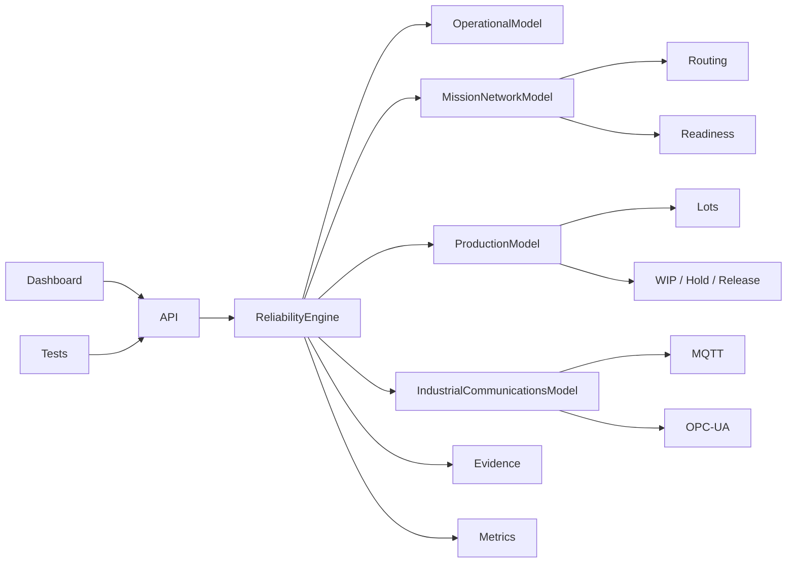

# Orbital Reliability Lab

[](https://github.com/Lordkoii/Orbital-Reliability-Lab/actions/workflows/ci.yml)

> **Reliability should be tested before it becomes an incident.**

**Orbital Reliability Lab (ORL)** is a systems reliability, automation, validation, production, network, and operations engineering lab for simulated high-consequence environments.

ORL models two operational domains on one shared reliability core:

- **Mission Operations** — ground systems, telemetry, command, tracking, network redundancy, continuity, failover, and readiness
- **Factory Operations** — equipment lifecycles, material flow, MES dependencies, lot/wafer execution, MQTT equipment messaging, and OPC-UA session health

ORL is an independent engineering portfolio project. It is **not affiliated with SpaceX, Tesla, Starlink, Terafab, or their subsidiaries**, and it does not reproduce proprietary systems or processes.

## v0.6.0 — Industrial Communications

v0.6 adds two distinct deterministic industrial-communications reliability paths to Factory Operations while preserving the v0.5 Mission Network Model.

### MQTT equipment messaging

The simulated `ORL-MQTT-01` broker models equipment state/telemetry/health topics for:

`LITH-01 · ETCH-01 · DEP-01 · MET-01 · AMHS-01 · MES-01`

Evidence includes QoS, message sequence, successful publishes, dropped messages, endpoint connection state, reconnect count, last message, and validation state.

MQTT outage example:

`ONLINE → OFFLINE → 0/6 ENDPOINTS → WIP HOLD → RECONNECTING → REPUBLISH → VALIDATION PASS → ONLINE`

### OPC-UA metrology session

The simulated `ORL-OPCUA-01` adapter monitors a modeled `MET-01` state node and records session state, active sessions, Good reads, stale reads, last status, reconnect count, and validation evidence.

OPC-UA session-loss example:

`ONLINE / ACTIVE → SESSION_LOST / LOST → BadSessionClosed → QUALITY HOLD → RECONNECTING / NEGOTIATING → Good READBACK → PASS`

The MQTT broker and OPC-UA adapter are intentionally deterministic in-memory simulations. ORL does **not** claim a real broker, PLC, industrial controller, OPC-UA server, or factory integration.

The shared response contract remains:

`INJECT → DETECT → DIAGNOSE → ISOLATE → RECOVER → VALIDATE → EVIDENCE`

## Mission Operations

Mission Operations includes:

- redundant ground routes: `GS-A` / `GS-B`
- redundant telemetry gateways: `TEL-GW-01` / `TEL-GW-02`
- mission network fabric: `NET-CORE-01`
- tracking and command dependency propagation
- deterministic telemetry frame / sequence accounting
- received/lost frame counts and continuity percentage
- measured detection, route-transition, and interruption evidence
- network partition behavior
- `READY`, `DEGRADED`, and `NO-GO` readiness states
- post-recovery continuity validation

Nominal telemetry path:

`GS-A → TEL-GW-01 → NET-CORE-01 → MDB-01`

Ground-link failover example:

`GS-A DEGRADED → DETECT → GS-B FAILOVER → RECOVER → VALIDATE → MISSION READY`

## Factory Operations

The mini-MES model tracks a simplified semiconductor-style production flow.

Equipment lifecycle:

`IDLE → SETUP → RUNNING → COMPLETE → IDLE`

Production route:

`LITHOGRAPHY → ETCH → DEPOSITION → METROLOGY → COMPLETE`

Reliability events can protect production through HOLD/STARVED/quality-release behavior, with release only after the relevant recovery validation completes.

Examples:

- **MQTT Broker Outage** → all equipment messaging disconnects, publish attempts drop, active WIP is held, endpoints reconnect, telemetry is republished, and communications must validate
- **OPC-UA Session Loss** → metrology session is lost, stale read evidence is recorded, quality-sensitive WIP is protected, session reconnects, node readback must return `Good`
- **MES outage** → process equipment and WIP lots enter `HOLD`
- **AMHS saturation** → process equipment becomes `STARVED`
- **Metrology link loss** → affected quality flow is held

## What the project demonstrates

- state-machine design
- dependency-aware failure propagation
- redundant network and service-route modeling
- deterministic telemetry/frame accounting
- continuity and failover measurement
- mission readiness evaluation
- simplified MES / production execution concepts
- lot, wafer, recipe, and process-route tracking
- simulated MQTT equipment messaging and reconnect validation
- simulated OPC-UA session monitoring and node readback validation
- controlled fault injection
- threshold-based incident detection
- automated/manual recovery
- post-recovery validation and reconciliation
- operational impact modeling
- MTTR and retained incident evidence
- Prometheus-style mission, factory, MQTT, and OPC-UA metrics
- Node + Playwright test automation
- GitHub Actions CI
- Dockerized execution

## Run locally

Requires Node.js 20+.

```bash
npm install
npm start
```

Open `http://localhost:3000`.

For development:

```bash
npm run dev
```

## Tests

```bash
npm test
npx playwright install chromium
npm run test:e2e
```

Additional suites:

```bash
npm run test:api
npm run test:ui
```

For the smoke check, start ORL in one terminal and run this in a second terminal:

```bash
npm run smoke
```

The smoke check uses `http://127.0.0.1:3000` unless `BASE_URL` is supplied.

## API

| Method | Endpoint | Purpose |
|---|---|---|
| `GET` | `/api/telemetry` | Environment, asset states, mission/factory state, impact, and metrics |
| `GET` | `/api/environments` | Available simulation environments |
| `POST` | `/api/environment` | Switch Mission / Factory Operations |
| `GET` | `/api/scenarios` | Scenarios for the active environment |
| `POST` | `/api/scenarios/run` | Run a domain-specific controlled failure |
| `GET` | `/api/mission/network` | Read mission route, frames, failover, validation, and readiness state |
| `POST` | `/api/mission/frames` | Advance deterministic mission telemetry frames |
| `POST` | `/api/systems/advance` | Advance a factory equipment lifecycle |
| `GET` | `/api/production` | Read mini-MES recipe, lot, WIP, and history state |
| `POST` | `/api/production/lots` | Create a factory production lot |
| `POST` | `/api/production/advance` | Start/complete the next lot operation |
| `GET` | `/api/factory/communications` | Read MQTT and OPC-UA communications state/evidence |
| `POST` | `/api/factory/communications/publish` | Publish/attempt a factory equipment MQTT snapshot |
| `POST` | `/api/factory/communications/opcua/read` | Perform/attempt the simulated metrology node read |
| `GET` | `/api/events` | Incident, network, MES, protocol, and recovery evidence stream |
| `GET` | `/api/metrics` | Prometheus-style global, mission, production, MQTT, and OPC-UA metrics |
| `GET` | `/api/health` | Health endpoint including active-domain readiness/communications context |
| `POST` | `/api/faults` | Inject a generic infrastructure fault |
| `POST` | `/api/recover` | Trigger manual recovery |
| `POST` | `/api/auto-recovery` | Arm/disarm automatic recovery |
| `POST` | `/api/reset` | Reset the active environment |

## Architecture



See:

- [`docs/DEMO.md`](docs/DEMO.md)
- [`docs/ARCHITECTURE.md`](docs/ARCHITECTURE.md)
- [`docs/STATE-MODELS.md`](docs/STATE-MODELS.md)
- [`docs/MISSION-NETWORK-MODEL.md`](docs/MISSION-NETWORK-MODEL.md)
- [`docs/PRODUCTION-MODEL.md`](docs/PRODUCTION-MODEL.md)
- [`docs/INDUSTRIAL-COMMUNICATIONS.md`](docs/INDUSTRIAL-COMMUNICATIONS.md)
- [`docs/ROADMAP.md`](docs/ROADMAP.md)

## Direction

v0.6.0 is the first presentation-focused checkpoint combining mature Mission failover/readiness behavior with Factory production and industrial-communications reliability flows.

Next major engineering track: **v0.7 Observability Platform** — persistent event/telemetry history, expanded Prometheus coverage, Grafana, SLO views, and incident trends.

## Author

**Alexander Taylor** · [Lordkoii](https://github.com/Lordkoii)
