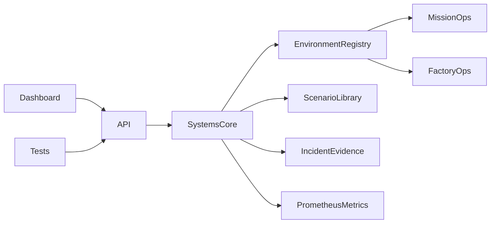

# Orbital Reliability Lab

[](https://github.com/Lordkoii/Orbital-Reliability-Lab/actions/workflows/ci.yml)

> **Reliability should be tested before it becomes an incident.**

**Orbital Reliability Lab (ORL)** is a systems reliability, automation, and operations engineering lab for simulated high-consequence environments.

The project is evolving around two application domains that share the same reliability core:

- **Mission Operations** — ground systems, telemetry, command, tracking, redundancy, and readiness
- **Factory Operations** — equipment interfaces, automation, production tracking, process visibility, and validation

ORL is an independent engineering portfolio project. It is **not affiliated with SpaceX, Tesla, Starlink, Terafab, or their subsidiaries**, and it does not reproduce proprietary systems or processes.

## v0.2 — Systems Core

v0.2 separates the reliability lifecycle from the simulated domain. Both environments now run through the same core:

`INJECT → DETECT → DIAGNOSE → ISOLATE → RECOVER → VALIDATE → EVIDENCE`

### What it demonstrates

- reusable reliability/fault-recovery engine
- domain-aware scenario execution
- environment and asset state modeling
- controlled fault injection
- threshold-based detection and fault-domain context
- automated/manual recovery
- post-recovery validation
- MTTR and incident evidence
- Prometheus-style metrics
- Node and Playwright automation
- GitHub Actions CI
- Dockerized execution

## Environments

### Mission Operations

Current systems:

`TEL-GW-01` · `CMD-01` · `TRACK-01` · `GS-A` · `GS-B` · `MDB-01`

Current scenarios include ground-link degradation, telemetry gateway outage, and mission compute saturation.

### Factory Operations

Current systems:

`LITH-01` · `ETCH-01` · `DEP-01` · `MET-01` · `AMHS-01` · `MES-01`

Current scenarios include equipment-link loss, MES gateway outage, and control-node saturation.

These are intentionally simplified abstractions used to demonstrate software, reliability, testing, and operational engineering concepts.

## Run locally

```bash
npm start
```

Open `http://localhost:3000`.

## Tests

```bash
npm test

npm install
npx playwright install chromium
npm run test:e2e
```

## API

| Method | Endpoint | Purpose |
|---|---|---|
| `GET` | `/api/telemetry` | Current environment, system states, and metrics |
| `GET` | `/api/environments` | Available simulation environments |
| `POST` | `/api/environment` | Switch the active environment |
| `GET` | `/api/scenarios` | Scenarios for the active environment |
| `POST` | `/api/scenarios/run` | Run a domain-specific controlled failure |
| `GET` | `/api/events` | Incident/recovery evidence stream |
| `GET` | `/api/metrics` | Prometheus-style reliability metrics |
| `GET` | `/api/health` | Health status suitable for probes |
| `POST` | `/api/faults` | Inject a generic infrastructure fault |
| `POST` | `/api/recover` | Trigger manual recovery |
| `POST` | `/api/auto-recovery` | Arm/disarm automatic recovery |
| `POST` | `/api/reset` | Reset the active environment |

Example scenario:

```bash
curl -X POST http://localhost:3000/api/scenarios/run \
  -H "Content-Type: application/json" \
  -d '{"id":"mission-ground-link-degradation"}'
```

## Architecture



See [`docs/ARCHITECTURE.md`](docs/ARCHITECTURE.md) and the evolving [`docs/ROADMAP.md`](docs/ROADMAP.md).

## Why this project exists

ORL is built to make practical engineering skills visible: QA and validation, incident response, platform/reliability thinking, APIs, infrastructure, observability, databases, and operational troubleshooting.

The long-term goal is not to imitate a specific company. It is to explore a problem shared across demanding engineering organizations:

**When software interacts with complex physical operations, can failures be detected quickly, isolated safely, recovered deliberately, and proven healthy with evidence?**

## Roadmap

The project will expand in two directions while preserving a shared core:

- Factory: equipment state models → MQTT/OPC-UA → mini-MES → SPC → FAT/SAT-style validation
- Mission: ground systems → telemetry failover → readiness validation → distributed reliability scenarios
- Shared: PostgreSQL → Grafana → richer metrics → scenario reports → container/Kubernetes reliability

Full roadmap: [`docs/ROADMAP.md`](docs/ROADMAP.md)

## Author

**Alexander Taylor** · [Lordkoii](https://github.com/Lordkoii)
