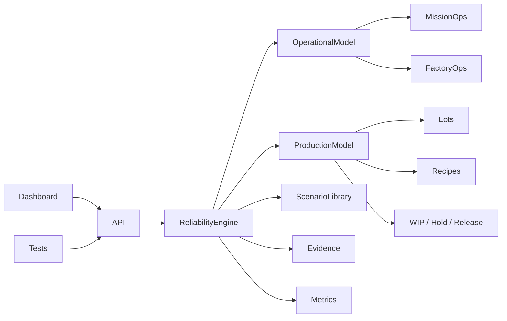

# Orbital Reliability Lab

[](https://github.com/Lordkoii/Orbital-Reliability-Lab/actions/workflows/ci.yml)

> **Reliability should be tested before it becomes an incident.**

**Orbital Reliability Lab (ORL)** is a systems reliability, automation, validation, production, and operations engineering lab for simulated high-consequence environments.

ORL models two operational domains on one shared reliability core:

- **Mission Operations** — ground systems, telemetry, command, tracking, redundancy, and failover
- **Factory Operations** — equipment lifecycles, material flow, MES dependencies, lot/wafer execution, and production-state protection

ORL is an independent engineering portfolio project. It is **not affiliated with SpaceX, Tesla, Starlink, Terafab, or their subsidiaries**, and it does not reproduce proprietary systems or processes.

## v0.4 — Factory Production Model

v0.4 adds a simplified mini-MES and production execution model on top of the v0.3 operational-state foundation.

Factory Operations now includes:

- 25-wafer production lots
- recipe-defined routing across `LITH-01 → ETCH-01 → DEP-01 → MET-01`
- `QUEUED`, `RUNNING`, `HOLD`, and `COMPLETED` lot states
- per-lot operation history and tool assignment
- WIP, held-lot, completed-lot, and wafer-in-WIP metrics
- lot creation and deterministic route advancement APIs
- incident-aware production protection
- post-recovery state reconciliation and release

A production lot follows a simplified route:

`LITHOGRAPHY → ETCH → DEPOSITION → METROLOGY → COMPLETE`

Reliability events now affect production state. For example:

`MES-01 FAULT → LOT HOLD → EQUIPMENT HOLD → RECOVERY → VALIDATION → LOT RELEASE`

The shared response contract remains:

`INJECT → DETECT → DIAGNOSE → ISOLATE → RECOVER → VALIDATE → EVIDENCE`

## Mission Operations

Nominal telemetry path:

`GS-A (PRIMARY) → TEL-GW-01 → MDB-01`

with `GS-B` held in `STANDBY`. Ground-link incidents can trigger dependency-aware failover and telemetry-path validation.

## Factory Operations

Process equipment implements a simplified lifecycle:

`IDLE → SETUP → RUNNING → COMPLETE → IDLE`

Shared-system failures produce operational consequences:

- **MES outage** → process equipment and WIP lots enter `HOLD`
- **AMHS saturation** → process equipment becomes `STARVED`; production is protected
- **Metrology link loss** → quality release is held for affected metrology flow

## What the project demonstrates

- state-machine design
- dependency-aware failure propagation
- redundancy and failover modeling
- simplified MES / production execution concepts
- lot, wafer, recipe, and process-route tracking
- controlled fault injection
- threshold-based incident detection
- automated/manual recovery
- post-recovery validation and production reconciliation
- operational impact modeling
- MTTR and incident evidence
- Prometheus-style system, asset, and factory-production metrics
- Node + Playwright test automation
- GitHub Actions CI
- Dockerized execution

## Run locally

```bash
npm start
```

Open `http://localhost:3000`.

## Tests

```bash
npm test

npm install
npx playwright install chromium
npm run test:e2e
```

## API

| Method | Endpoint | Purpose |
|---|---|---|
| `GET` | `/api/telemetry` | Environment, asset states, production state, impact, and metrics |
| `GET` | `/api/environments` | Available simulation environments |
| `POST` | `/api/environment` | Switch Mission / Factory Operations |
| `GET` | `/api/scenarios` | Scenarios for the active environment |
| `POST` | `/api/scenarios/run` | Run a domain-specific controlled failure |
| `POST` | `/api/systems/advance` | Advance a factory equipment lifecycle |
| `GET` | `/api/production` | Read mini-MES recipe, lot, WIP, and history state |
| `POST` | `/api/production/lots` | Create a factory production lot |
| `POST` | `/api/production/advance` | Start/complete the next lot operation |
| `GET` | `/api/events` | Incident, MES, and recovery evidence stream |
| `GET` | `/api/metrics` | Prometheus-style global, asset, and production metrics |
| `GET` | `/api/health` | Health endpoint for probes |
| `POST` | `/api/faults` | Inject a generic infrastructure fault |
| `POST` | `/api/recover` | Trigger manual recovery |
| `POST` | `/api/auto-recovery` | Arm/disarm automatic recovery |
| `POST` | `/api/reset` | Reset the active environment |

## Architecture



See:

- [`docs/ARCHITECTURE.md`](docs/ARCHITECTURE.md)
- [`docs/STATE-MODELS.md`](docs/STATE-MODELS.md)
- [`docs/PRODUCTION-MODEL.md`](docs/PRODUCTION-MODEL.md)
- [`docs/ROADMAP.md`](docs/ROADMAP.md)

## Direction

The project is intentionally growing toward engineering concepts relevant to both advanced manufacturing systems and space/mission reliability work.

Next major track: **v0.5 Mission Network Model** — richer telemetry routing, continuity metrics, network partitions, command/tracking dependencies, and mission readiness state.

## Author

**Alexander Taylor** · [Lordkoii](https://github.com/Lordkoii)
