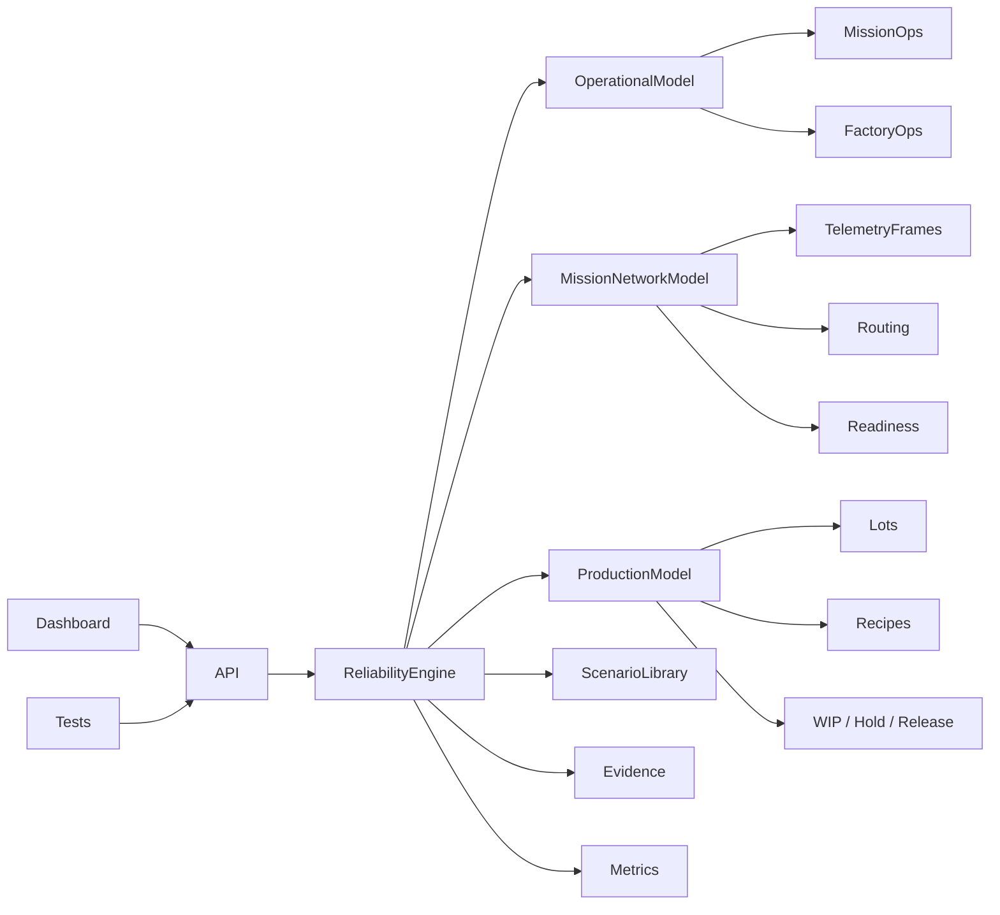

# Orbital Reliability Lab

[](https://github.com/Lordkoii/Orbital-Reliability-Lab/actions/workflows/ci.yml)

> **Reliability should be tested before it becomes an incident.**

**Orbital Reliability Lab (ORL)** is a systems reliability, automation, validation, production, network, and operations engineering lab for simulated high-consequence environments.

ORL models two operational domains on one shared reliability core:

- **Mission Operations** — ground systems, telemetry, command, tracking, network redundancy, continuity, and failover
- **Factory Operations** — equipment lifecycles, material flow, MES dependencies, lot/wafer execution, and production-state protection

ORL is an independent engineering portfolio project. It is **not affiliated with SpaceX, Tesla, Starlink, Terafab, or their subsidiaries**, and it does not reproduce proprietary systems or processes.

## v0.5 — Mission Network Model

v0.5 expands Mission Operations from simple primary/standby state transitions into a deterministic network and telemetry-continuity model.

Mission Operations now includes:

- redundant ground routes: `GS-A` / `GS-B`
- redundant telemetry gateways: `TEL-GW-01` / `TEL-GW-02`
- a mission network fabric: `NET-CORE-01`
- tracking and command dependency propagation
- telemetry frame and sequence accounting
- received/lost frame counts and continuity percentage
- deterministic ground-link degradation and complete interruption windows
- measured detection, route-transition, and total interruption evidence
- network-partition behavior
- mission readiness checks with `READY`, `DEGRADED`, and `NO-GO` states
- post-recovery continuity validation
- mission-specific APIs, Prometheus-style metrics, and dashboard evidence

Nominal telemetry path:

`GS-A → TEL-GW-01 → NET-CORE-01 → MDB-01`

Ground-link failover example:

`GS-A DEGRADED → DETECT → GS-B PRIMARY → RECOVER → VALIDATE → GS-A PRIMARY`

Telemetry-gateway failover example:

`TEL-GW-01 UNAVAILABLE → DETECT → TEL-GW-02 ACTIVE → RECOVER → VALIDATE → TEL-GW-01 ACTIVE`

Network partition example:

`NET-CORE-01 PARTITIONED → TRACK-01 BLOCKED + CMD-01 BLOCKED → MISSION NO-GO`

The shared response contract remains:

`INJECT → DETECT → DIAGNOSE → ISOLATE → RECOVER → VALIDATE → EVIDENCE`

## Mission Operations

Mission readiness evaluates six simulated checks:

1. active ground path availability
2. active telemetry gateway availability
3. mission network fabric health
4. tracking dependency health
5. command dependency health
6. latest telemetry continuity ≥ 99%

The model records frame continuity and failover evidence separately from the generic system metrics so a route can be restored while still requiring validation.

## Factory Operations

The v0.4 mini-MES and production model remain active in Factory Operations.

Process equipment implements a simplified lifecycle:

`IDLE → SETUP → RUNNING → COMPLETE → IDLE`

A production lot follows:

`LITHOGRAPHY → ETCH → DEPOSITION → METROLOGY → COMPLETE`

Shared-system failures produce operational consequences:

- **MES outage** → process equipment and WIP lots enter `HOLD`
- **AMHS saturation** → process equipment becomes `STARVED`; production is protected
- **Metrology link loss** → quality release is held for affected metrology flow

## What the project demonstrates

- state-machine design
- dependency-aware failure propagation
- redundant network and service-route modeling
- deterministic telemetry frame accounting
- continuity and failover measurement
- mission readiness evaluation
- simplified MES / production execution concepts
- lot, wafer, recipe, and process-route tracking
- controlled fault injection
- threshold-based incident detection
- automated/manual recovery
- post-recovery validation and reconciliation
- operational impact modeling
- MTTR and incident evidence
- Prometheus-style system, mission-network, and factory-production metrics
- Node + Playwright test automation
- GitHub Actions CI
- Dockerized execution

## Run locally

```bash
npm start
```

Open `http://localhost:3000`.

## Tests

```bash
npm test

npm install
npx playwright install chromium
npm run test:e2e
```

## API

| Method | Endpoint | Purpose |
|---|---|---|
| `GET` | `/api/telemetry` | Environment, asset states, mission/factory state, impact, and metrics |
| `GET` | `/api/environments` | Available simulation environments |
| `POST` | `/api/environment` | Switch Mission / Factory Operations |
| `GET` | `/api/scenarios` | Scenarios for the active environment |
| `POST` | `/api/scenarios/run` | Run a domain-specific controlled failure |
| `GET` | `/api/mission/network` | Read mission route, frames, failover, validation, and readiness state |
| `POST` | `/api/mission/frames` | Advance deterministic mission telemetry frames |
| `POST` | `/api/systems/advance` | Advance a factory equipment lifecycle |
| `GET` | `/api/production` | Read mini-MES recipe, lot, WIP, and history state |
| `POST` | `/api/production/lots` | Create a factory production lot |
| `POST` | `/api/production/advance` | Start/complete the next lot operation |
| `GET` | `/api/events` | Incident, network, MES, and recovery evidence stream |
| `GET` | `/api/metrics` | Prometheus-style global, asset, mission, and production metrics |
| `GET` | `/api/health` | Health endpoint including active-domain readiness context |
| `POST` | `/api/faults` | Inject a generic infrastructure fault |
| `POST` | `/api/recover` | Trigger manual recovery |
| `POST` | `/api/auto-recovery` | Arm/disarm automatic recovery |
| `POST` | `/api/reset` | Reset the active environment |

## Architecture



See:

- [`docs/ARCHITECTURE.md`](docs/ARCHITECTURE.md)
- [`docs/STATE-MODELS.md`](docs/STATE-MODELS.md)
- [`docs/MISSION-NETWORK-MODEL.md`](docs/MISSION-NETWORK-MODEL.md)
- [`docs/PRODUCTION-MODEL.md`](docs/PRODUCTION-MODEL.md)
- [`docs/ROADMAP.md`](docs/ROADMAP.md)

## Direction

The project is intentionally growing toward engineering concepts relevant to both advanced manufacturing systems and space/mission reliability work.

Next major track: **v0.6 Industrial Communications** — MQTT telemetry, OPC-UA simulation, communications health, and reconnect scenarios.

## Author

**Alexander Taylor** · [Lordkoii](https://github.com/Lordkoii)
