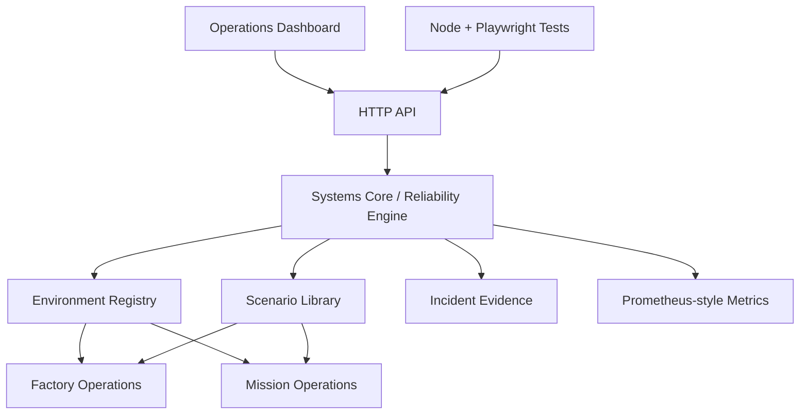

# Architecture — v0.2 Systems Core

Orbital Reliability Lab is evolving into a shared reliability platform with multiple operational environments. The project deliberately separates the **reliability lifecycle** from the domain being simulated.

## Core principle

`INJECT → DETECT → DIAGNOSE → ISOLATE → RECOVER → VALIDATE → EVIDENCE`

The same lifecycle should work whether the simulated target is a factory equipment interface or a mission ground service.

## Systems Core

`ReliabilityEngine` owns shared behavior:

- system state transitions
- controlled fault injection
- threshold-based detection
- target/fault-domain context
- automated and manual recovery
- post-recovery validation
- MTTR capture
- incident evidence
- environment switching
- scenario execution

## Environment registry

`src/environments.js` defines domain metadata and assets.

### Mission Operations

Current simulated assets include:

- Telemetry Gateway
- Command Service
- Tracking Service
- Ground Station A / B
- Mission Database

### Factory Operations

Current simulated assets include:

- Lithography Tool
- Etch Tool
- Deposition Tool
- Metrology Tool
- Automated Material Handling
- MES Gateway

These are intentionally simplified systems models, not replicas of proprietary hardware or processes.

## Scenario library

`src/scenario-library.js` maps operational scenarios to the shared core. Each scenario declares:

- environment
- failure type
- target asset
- scenario summary
- expected reliability response

Future versions can extend this contract with prerequisites, acceptance criteria, runbook actions, event timelines, and exported evidence.

## Next architectural layers

Planned additions include MQTT/OPC-UA adapters, PostgreSQL event history, Grafana dashboards, factory lot/recipe models, ground-link failover, readiness/acceptance test suites, and container/Kubernetes deployment targets.
