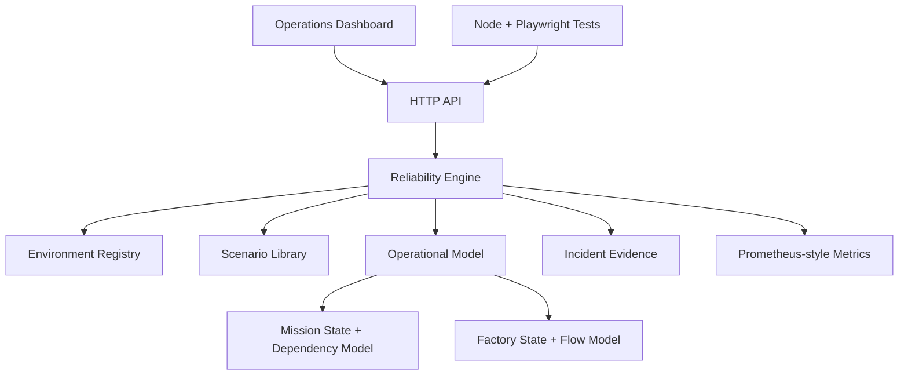

# Architecture — v0.3 Operational State Models

Orbital Reliability Lab separates a shared reliability lifecycle from the operational domain being simulated.

## Shared response contract

`INJECT → DETECT → DIAGNOSE → ISOLATE → RECOVER → VALIDATE → EVIDENCE`

## Reliability Engine

`src/reliability-engine.js` owns the cross-domain incident lifecycle:

- environment switching
- scenario execution
- controlled fault injection
- detection and diagnosis timing
- isolation
- automatic/manual recovery
- post-recovery validation
- MTTR capture
- event evidence

It delegates asset-level operational behavior to `OperationalModel`.

## Operational Model

`src/operational-model.js` owns per-asset state and dependency effects.

It tracks:

- operational state
- health
- operator-facing notes
- active mission path / factory process flow
- operational impact severity
- affected assets

### Mission behavior

The mission model includes primary/standby ground stations and service dependencies. A GS-A incident can transition GS-B into failover and temporarily change the active telemetry path.

### Factory behavior

Factory process tools implement a simplified equipment lifecycle and react to shared-system failures. MES loss can hold process tools, while material-handling failure can starve them.

## API additions in v0.3

`POST /api/systems/advance` advances a factory equipment lifecycle state.

`GET /api/telemetry` now includes:

- `systems[].state`
- `systems[].health`
- `systems[].note`
- `operationalImpact`
- `activePath`

`GET /api/metrics` includes per-asset health and a count of non-nominal assets.

## Design intent

The models are intentionally abstract. ORL is an engineering portfolio and learning environment, not a replica of proprietary mission or semiconductor manufacturing systems.
