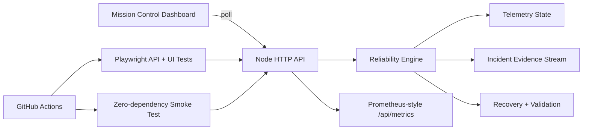

# Architecture

Orbital Reliability Lab is deliberately small enough to inspect quickly. The point is to show the reliability loop clearly rather than hide it behind a large framework.

## Components

### Reliability engine

A deterministic state machine around four system states:

`NOMINAL → DEGRADED → INCIDENT → RECOVERING → NOMINAL`

It owns controlled fault injection, threshold-confirmation timing, automatic recovery, post-recovery validation, MTTR calculation, and the incident event stream.

### HTTP API

Implemented with the Node.js standard library so the runtime itself has no external package dependencies. It exposes telemetry, health, fault injection, recovery controls, incident evidence, and Prometheus-style metrics.

### Dashboard

A dependency-free browser UI that polls the API and presents the current system state, telemetry metrics, incident count, last MTTR, chaos controls, and live incident evidence.

### Test layers

1. **Node unit tests** validate engine behavior with no package installation required.
2. **Smoke test** exercises a real running process end-to-end using Node's built-in `fetch`.
3. **Playwright** validates both API behavior and browser state transitions in CI.

## Reliability design choices

- Fault injection is explicit and controlled.
- Detection is separated from injection to model alerting latency.
- Recovery is separated from validation so a recovery action is not treated as success until health checks finish.
- Incident evidence records each stage of the response path.
- The health endpoint returns `503` only during confirmed incidents, making probe behavior observable.
- Metrics are scrape-friendly for later Prometheus/Grafana integration.
