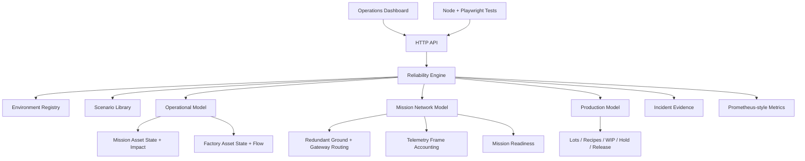

# Architecture — v0.5 Mission Network Model

Orbital Reliability Lab separates a shared reliability lifecycle from the operational domain and specialized state models being simulated.

## Shared response contract

`INJECT → DETECT → DIAGNOSE → ISOLATE → RECOVER → VALIDATE → EVIDENCE`

## Reliability Engine

`src/reliability-engine.js` owns the cross-domain incident lifecycle:

- environment switching
- scenario execution
- controlled fault injection
- detection and diagnosis timing
- isolation
- automatic/manual recovery
- post-recovery validation
- MTTR capture
- event evidence

It coordinates specialized models rather than forcing every domain behavior into one state machine.

## Operational Model

`src/operational-model.js` owns per-asset state and dependency effects.

It tracks:

- operational state
- health
- operator-facing notes
- active mission path / factory process flow
- operational impact severity
- affected assets

Mission asset state and the mission network model deliberately overlap at the boundary: the operational model tells an operator *what systems are affected*, while the network model measures *how telemetry and dependencies behave through the event*.

## Mission Network Model

`src/mission-network-model.js` owns deterministic Mission Operations network behavior.

It tracks:

- primary/redundant ground routes
- primary/redundant telemetry gateways
- mission network fabric state
- telemetry frame sequence numbers
- received/lost frames and sequence gaps
- latest-window and cumulative continuity
- network partition state
- detection and route-transition timing evidence
- post-recovery continuity validation
- mission readiness checks and score

Nominal route:

`GS-A → TEL-GW-01 → NET-CORE-01 → MDB-01`

A ground-link failure can switch the route to:

`GS-B → TEL-GW-01 → NET-CORE-01 → MDB-01`

A primary telemetry gateway failure can switch the route to:

`GS-A → TEL-GW-02 → NET-CORE-01 → MDB-01`

A mission backbone partition blocks the modeled tracking and command dependencies and drives readiness to `NO-GO` until recovery and validation complete.

## Production Model

`src/production-model.js` remains the factory-specific mini-MES model introduced in v0.4. It owns recipes, lot/wafer execution, route progress, WIP, HOLD behavior, and validated RELEASE.

## Mission APIs in v0.5

`GET /api/mission/network` exposes:

- active mission route
- telemetry frame accounting
- failover evidence
- network partition state
- validation state
- mission readiness checks

`POST /api/mission/frames` deterministically advances a requested telemetry frame count.

`GET /api/telemetry` includes the same mission network snapshot alongside global and operational state.

`GET /api/health` reports mission readiness while Mission Operations is active.

`GET /api/metrics` adds mission frame, continuity, interruption, and readiness metrics.

## Design intent

The models are intentionally abstract and deterministic enough to test. ORL is an engineering portfolio and learning environment, not a replica of proprietary launch, spacecraft, ground-station, semiconductor, or factory-control systems.
