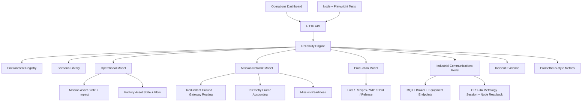

# Architecture — v0.6 Industrial Communications

Orbital Reliability Lab separates a shared reliability lifecycle from the operational domain and specialized state models being simulated.

## Shared response contract

`INJECT → DETECT → DIAGNOSE → ISOLATE → RECOVER → VALIDATE → EVIDENCE`

## Reliability Engine

`src/reliability-engine.js` owns the cross-domain incident lifecycle and coordinates the specialized models.

It owns:

- environment switching
- scenario execution
- controlled fault injection
- detection and diagnosis timing
- isolation
- automatic/manual recovery
- post-recovery validation
- production protection/release coordination
- MTTR capture
- event evidence

## Operational Model

`src/operational-model.js` owns per-asset state and dependency effects.

It tracks operational state, health, operator-facing notes, active mission/factory flow, impact severity, and affected assets.

## Mission Network Model

`src/mission-network-model.js` owns deterministic Mission Operations network behavior: redundant ground routes, telemetry gateways, frame accounting, continuity, failover timing, partitions, readiness, and post-recovery validation.

Nominal route:

`GS-A → TEL-GW-01 → NET-CORE-01 → MDB-01`

## Production Model

`src/production-model.js` owns the factory mini-MES model: recipes, lot/wafer execution, route progress, WIP, HOLD behavior, and validated RELEASE.

## Industrial Communications Model

`src/industrial-communications-model.js` owns deterministic communications state for Factory Operations.

### MQTT path

The simulated `ORL-MQTT-01` broker registers LITH, ETCH, DEP, MET, AMHS, and MES endpoints with state, telemetry, and health topics. It records sequence numbers, QoS, successful publishes, drops, connected clients, reconnect count, last-seen state, and validation evidence.

Broker outage lifecycle:

`ONLINE → OFFLINE → RECONNECTING → ONLINE`

A confirmed broker outage disconnects all registered equipment endpoints, records failed publish attempts, and can place active WIP on HOLD. Recovery reconnects endpoints, republishes telemetry, validates all paths, then permits production reconciliation/release.

### OPC-UA path

The simulated `ORL-OPCUA-01` adapter maintains a metrology session against the modeled `MET-01` state node. It records endpoint/node identity, session state, active session count, Good reads, stale reads, reconnect count, last status, and validation evidence.

Session-loss lifecycle:

`ONLINE / ACTIVE → SESSION_LOST / LOST → RECONNECTING / NEGOTIATING → ONLINE / ACTIVE`

A confirmed session loss records `BadSessionClosed` stale-read evidence and protects quality-sensitive WIP. Recovery re-establishes the session, performs a modeled node readback with `Good`, validates the path, then permits production release.

## APIs added for Factory communications

- `GET /api/factory/communications`
- `POST /api/factory/communications/publish`
- `POST /api/factory/communications/opcua/read`

`GET /api/health` and `GET /api/metrics` expose active communications state and validation evidence alongside factory production state.

## Design intent

The MQTT broker and OPC-UA adapter are deterministic in-memory simulations used to exercise reliability behavior. ORL does not claim a real broker, PLC, industrial controller, OPC-UA server, or proprietary factory implementation.
